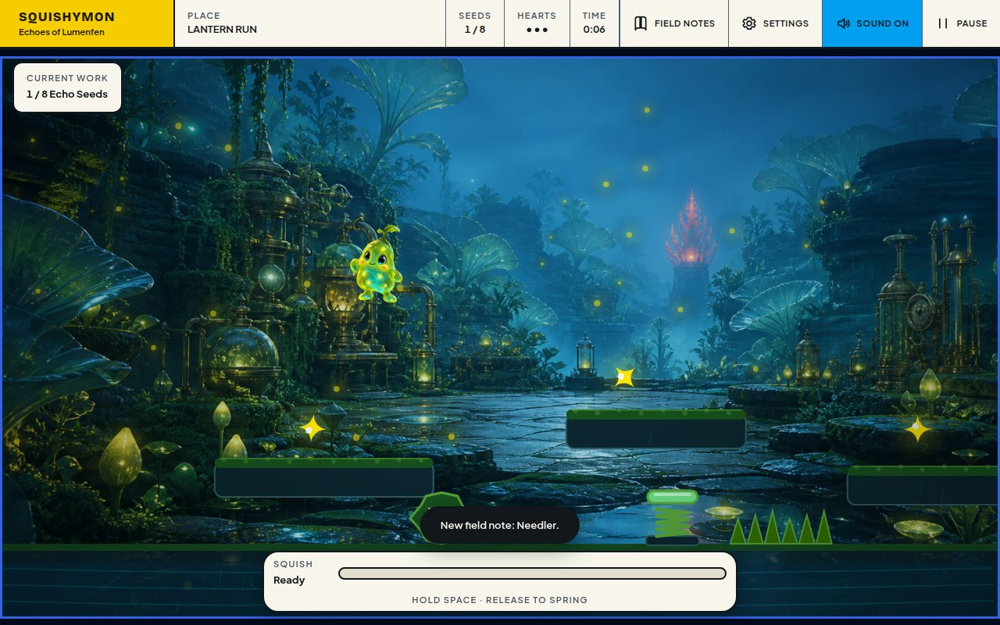
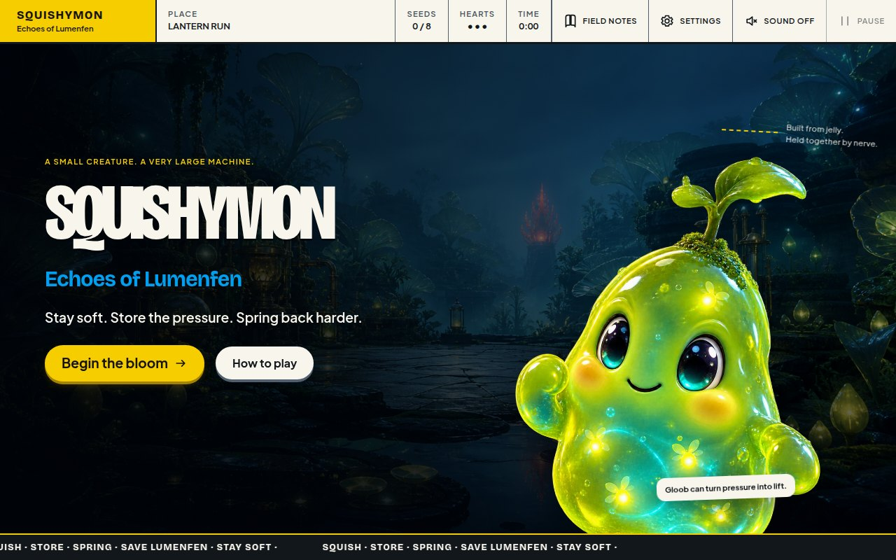
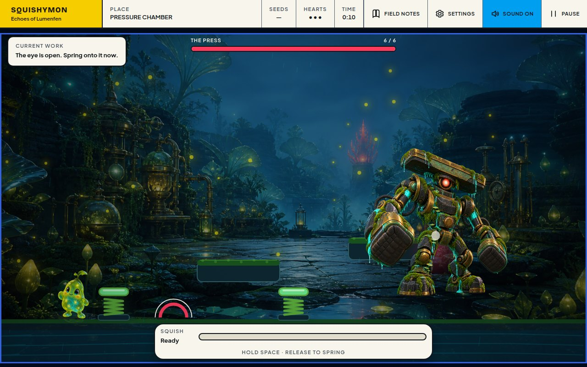
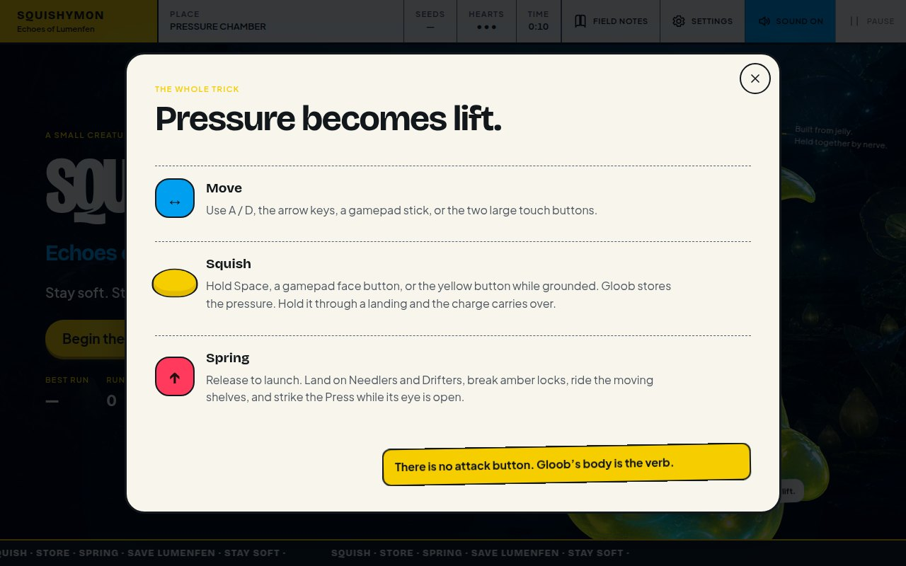
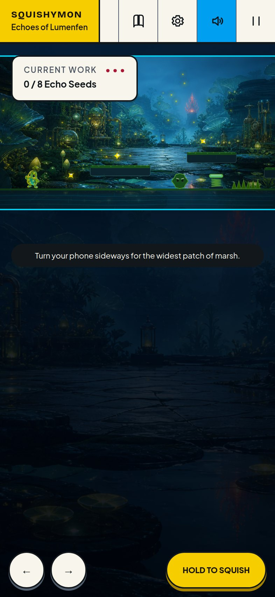

# Squishymon: Echoes of Lumenfen

A complete browser game about staying soft in a world built to press everything flat. You play Gloob, a translucent marsh creature who stores pressure by squishing and releases it as a spring-loaded jump.

No build step, no runtime dependencies, and no third-party requests: three generated PNGs, two self-hosted font files, some CSS, and about three thousand lines of ES modules.



| | |
| --- | --- |
|  |  |

## Play

```bash
npm start
```

Then open <http://127.0.0.1:4173>. The server binds to loopback only and serves nothing outside `index.html`, `src/`, `styles/`, and `assets/`.

## Controls

| Action | Keyboard | Gamepad | Touch |
| --- | --- | --- | --- |
| Move | `A` / `D` or arrows | Left stick or D-pad | Two large move buttons |
| Squish | Hold `Space` | Any face button or RT | Hold the yellow button |
| Spring | Release `Space` | Release | Release |
| Pause | `P` or `Escape` | — | Pause in the header |
| Sound | `M` | — | Sound in the header |

There is no attack button. Gloob's elastic body is the verb: bounce on Needlers and Drifters, break amber locks with a charged landing, ride the brass shelves, jump the Press's shockwaves, and strike its coral eye during the opening after a slam.

A squish held through a landing keeps charging, and a squish pressed just before touchdown is buffered — you never lose a jump to a frame of bad timing.

| | |
| --- | --- |
|  |  |

## Campaign

1. **Lantern Run** — collect eight Echo Seeds and reach the coral beacon.
2. **Root Vault** — gather ten seeds and break three cages to rescue captive Plinks.
3. **Pressure Chamber** — face the Press, a preservation automaton convinced that one permanent shape is the safest shape. At half health it stops being patient.

The story follows Gloob and the guiding mote Mote through Lumenfen's flooded research ruins. Field notes unlock as characters and creatures are encountered. Once you finish an act it stays available from the title screen, so you can replay a single chapter for a better time.

## What is in the box

**Movement and world**

- Fixed 120 Hz simulation with an accumulator, so physics is identical on a 60 Hz laptop and a 144 Hz monitor
- Squish charging with coyote grace and an input buffer across landings
- Moving brass shelves that carry the player, Bloomspring pads, patrolling Needlers, floating Drifters
- Echo chains: seeds gathered in quick succession raise a multiplier and lift the pickup arpeggio a scale degree at a time
- Checkpoints, hearts, mercy frames, per-act best times, and a full-run best

**Presentation**

- Canvas rendering at the device pixel ratio: parallax plate, wet reflections, rain, grain, fog, reactive lighting, particles, camera impact, and squash-and-stretch
- Procedural Web Audio for the entire soundtrack and every cue — no audio files ship with the game
- All canvas colours read from the same CSS custom properties as the page chrome, so the field and the UI can never drift apart

**Comfort and access**

- Assist mode: five hearts, a faster charge, longer mercy, and a slower Press
- Motion preference: follow the system, force full, or force reduced
- Keyboard, touch, and gamepad, all merged into one input snapshot
- Live-region narration for objectives, damage, unlocks, and act changes; every dialog is a native `<dialog>` with an accessible name
- Progress, settings, and field notes persist locally, and the game says so plainly when a browser blocks storage

## Verify

```bash
npm run check
```

That runs three things:

| Command | What it covers |
| --- | --- |
| `npm run check:syntax` | Parses every shipped module with `node --check` |
| `npm run check:static` | Markup/module contracts, token-only CSS, image a11y attributes, art checksums |
| `npm test` | 88 unit tests over the simulation, save format, level data, input, and server path policy |

The simulation is deliberately free of `document`, `window`, and `navigator`, so the full rule set — physics, damage, the boss state machine, act flow — is exercised headlessly in Node. The static check enforces that.

## Layout

```
index.html            markup and the ids src/ui/dom.js requires
server.mjs            zero-dependency dev server with a strict path policy
src/core/             constants, math, the event queue
src/data/             creatures, story beats, level geometry
src/game/             simulation, level building, input, save format
src/audio/            procedural Web Audio
src/render/           viewport, palette, effects, scene
src/ui/               DOM lookup, HUD, dialogs, panels, announcer
assets/art/           the three generated plates
assets/fonts/         self-hosted variable fonts and their OFL licenses
tests/                unit tests plus whole-project static checks
docs/                 architecture notes, asset provenance, screenshots
```

See [docs/ARCHITECTURE.md](docs/ARCHITECTURE.md) for how a frame flows through those pieces, and [docs/ASSET_PROVENANCE.md](docs/ASSET_PROVENANCE.md) for the art paths, dimensions, checksums, and exact generation prompts.
