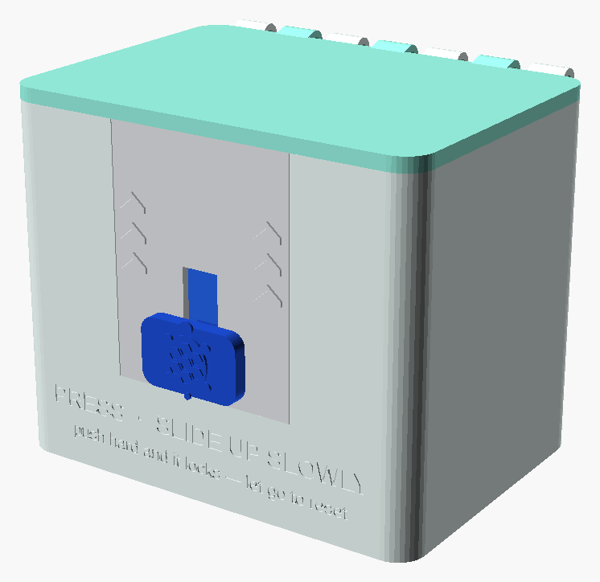
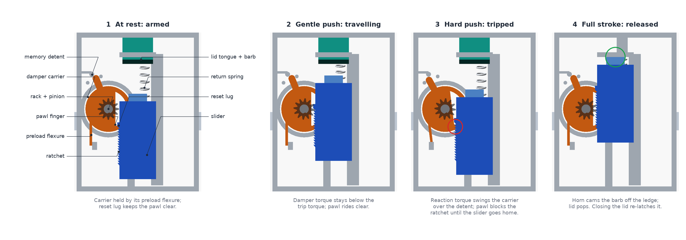
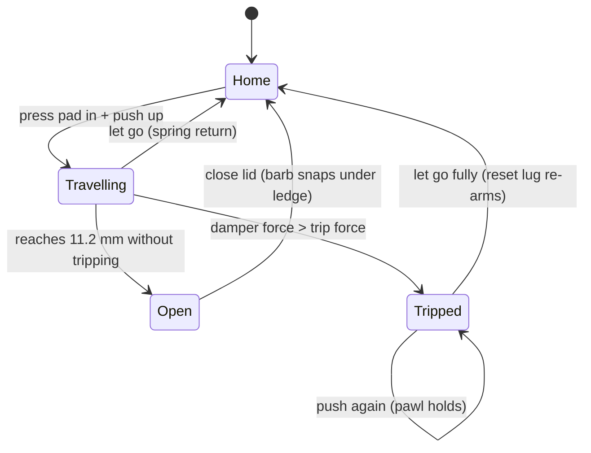
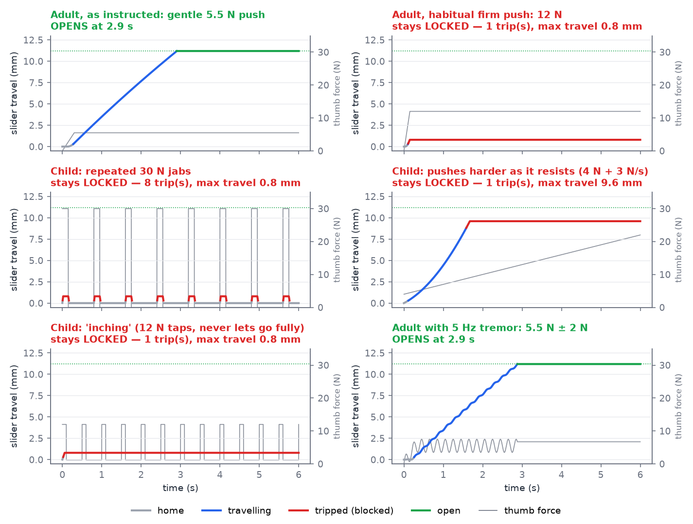
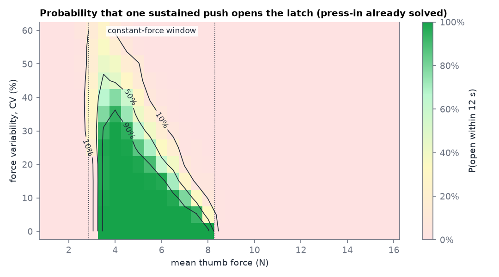
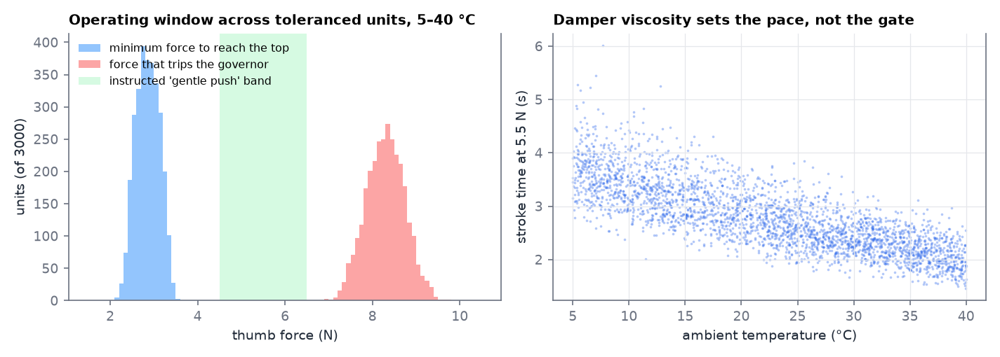
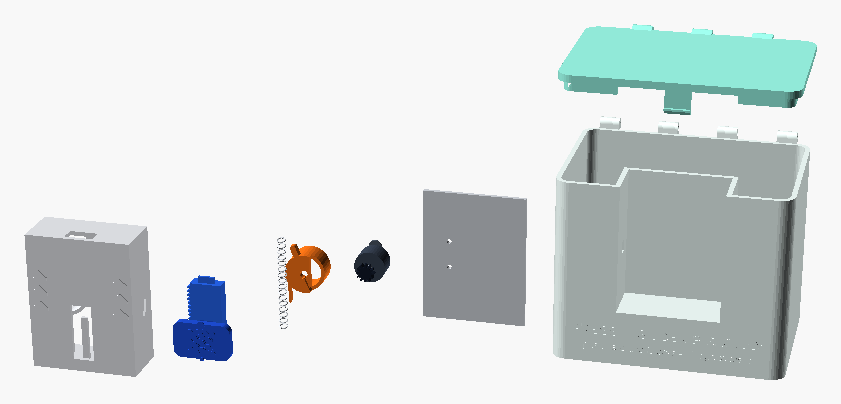

# TortoiseLatch: a child-resistant latch that opens only to a gentle push

**Status:** concept design with a physics model, parametric CAD, clearance checks and an
interactive demo. It has not been prototyped or panel-tested.



## The idea

Most child-resistant (CR) closures stop children with **strength** or with **two simultaneous
actions** (push-and-turn, squeeze-and-slide). Both also make the package harder for older adults,
especially those with arthritis. That is the tension the U.S. regulations test for.

TortoiseLatch adds a different gate: **it limits how hard and how fast you can push.**

* A gentle, steady thumb push (about 4–7 N) slides the latch open in 2–4 seconds.
* Push harder than about 8 N at any moment and a small governor **trips**. It blocks the slider
  and stays blocked **until you let go completely**. When the slider springs home, the latch
  re-arms.

The usual reaction to a stuck package is to push harder. On this latch, pushing harder is exactly
what locks it. It works like a Chinese finger trap. The key variable is how hard you are pushing,
and that can't be seen during a demonstration. A watching child sees "press the turtle and slide
it up", not "push with less than about 800 grams of force, steadily, for three seconds".

The governor is a commodity **one-way rotary damper**, the part used in soft-close lids. It is
mounted so that its own reaction torque sets off the lock.

## Opening and closing it

| | What you do | What happens |
|---|---|---|
| 1 | **Press** the turtle pad in (≈5 N) | Pad leaves its home pocket. |
| 2 | **Slide it up slowly**, about 3 seconds, as if sliding a heavy drawer | Damper sets an even, glide-like pace. |
| 3 | Near the top the lid **pops up** | Slider's horn has pushed the lid's barb off its ledge. |
| ✗ | Pushed too hard? It **clacks and stops** | Let go. The slider snaps home, re-arms, and you try again more gently. |
| ↺ | **Close** the lid until it clicks | Barb snaps under the ledge. There is nothing else to re-secure. |

The front of the package carries the instruction *"PRESS · SLIDE UP SLOWLY — push hard and it
locks, let go to reset"*. Raised chevrons and the turtle relief give a tactile cue as well as a
visual one.

## How it works



The latch is a self-contained **cassette** (40 × 20 × 52 mm) that snaps into a bay in the package
wall. Inside it:

| Part | Role |
|---|---|
| **Slider** (blue) | Carries the thumb pad, a **rack** (front layer) and a saw-tooth **ratchet** (back layer). A **reset lug** sits above the ratchet and a **horn** on top releases the lid. |
| **One-way rotary gear damper** | Pinion meshes with the rack. It resists opening with force ∝ speed and free-wheels on return. |
| **Governor carrier** (orange) | Clamps the damper body and **pivots on the damper's own axis**, so tripping never disturbs the gear mesh. It carries the **pawl finger**, the **memory tail** and a **preload flexure**. |
| **Memory detent** | Over-centre leaf and bump between two hard stops, making the carrier **bistable** (armed or tripped). |
| **Return spring** | Low-rate spring (1.5 N preload, 0.05 N/mm) that sends the slider home when released. |
| **Lid tongue and barb** | Hooks under a ledge in the cassette. The barb's chamfer auto-latches the lid when it is shut. |



### The physics in four lines

1. Pushing the slider at speed *v* makes the damper resist with force *F<sub>d</sub> = b·v*. The
   slider has about 4 g of mass against 700 N·s/m of damping, so its inertia is negligible.
2. The damper's body feels the same torque, *F<sub>d</sub>·r<sub>pinion</sub>*, and tries to turn
   the carrier. The preload flexure and detent hold the carrier until that torque exceeds
   **T<sub>trip</sub> = 1.8 N·cm**.
3. So the latch trips whenever the net push goes over *F<sub>trip</sub> = T<sub>trip</sub> /
   r<sub>pinion</sub> = 6 N*. After adding the spring and friction, that is **about 8.3 N at the
   pad**.
4. The constant-push **window** is [spring(top) + friction, spring(home) + friction +
   F<sub>trip</sub>], which is **2.9–8.3 N**. Its width, *F<sub>trip</sub> − k·stroke*, does not
   depend on friction, and neither edge depends on viscosity.
   **Temperature and damper tolerance change the pace, not the gate.**

### Why a child can't "inch" it open

A tripped carrier is **latched** by the detent. The pawl's flat face bears on the ratchet's flat
upper faces, so upward load drives the pawl deeper. Only the reset lug can un-trip it, and the
lug reaches the pawl in the **last ~0.7 mm of return to home**. Taps, jiggles and partial
releases make no progress; every attempt starts again from home. The same lug also stops the
carrier tripping while the slider is at home.

## Simulated behaviour

`sim/governor.py` is a quasi-static model of the mechanism. It includes the press-in detent,
Coulomb friction, spring, one-way damper, a 4 ms carrier response, ratchet pitch, latched trip
and home reset.



| Input | Outcome |
|---|---|
| Adult following the instructions: 5.5 N steady | **Opens in 2.9 s** |
| Adult with 5 Hz tremor, 5.5 N ± 2 N | **Opens in 2.9 s** |
| Habitual firm push, 12 N | Trips; slider stops at 0.8 mm |
| Repeated 30 N jabs | Trips on every jab; never passes 0.8 mm |
| "Push harder as it resists" (4 N rising 3 N/s) | Trips at 9.6 mm, short of the 11.2 mm release |
| 12 N taps without fully letting go | One trip, then held; no inching |



The success map shows *who* gets through: a steady push anywhere in the window almost always
opens it. A push whose force wanders by 30 % (coefficient of variation) succeeds about 40 % of
the time, and at 50 % variability it essentially never does. The latch **turns force
unsteadiness into failure.** Young children produce more variable force than adults, and
slowing down a movement on purpose is a classic effortful-control task that is still developing
at 3–4 years (the "walk-a-line slowly" type tasks in Kochanska et al.'s inhibitory-control
battery).

> **Caveat:** this is a parametric model, not a prediction of panel results. No one has measured
> the force-steadiness of 42–51-month-olds on this task. A calm child who happens to push gently
> and steadily for three seconds *will* open it. The latch raises the bar alongside the
> press-in; it is not a guarantee. Only a 16 CFR 1700.20 panel can say how much it raises it.

### Tolerance and temperature



We simulated 3000 units with: damper ±20 % (2σ) plus silicone-oil viscosity over 5–40 °C, trip
torque ±12 %, spring rate ±20 %, spring preload ±15 % and friction ±50 %. Results:

* Minimum push to open: 2.3–3.4 N (1st–99th percentile). Trip threshold: 7.3–9.3 N.
* **100 %** of units open with a 5.5 N push, and **100 %** trip under 10 N.
* Stroke time at 5.5 N: 1.7–4.4 s. Cold makes it slower but never locks it.
* The return spring beats friction in every unit, so a released slider always gets home to
  re-arm.

`docs/summary.json` holds every number quoted here.

## Senior and accessibility notes

* **Low forces, one hand, no twisting.** Press 5 N, glide at 3–8 N, with the thumb while the
  fingers hold the tub. There are no pinch grips or wrist torques, and no simultaneous
  opposite-direction actions.
* **Immediate, learnable feedback.** A trip clacks and stops the pad, and letting go resets it.
  An optional trip flag on the memory tail, seen through a slit, can show red/green.
* **Automatic re-securing.** Shutting the lid latches it. The senior-adult test scores
  re-securing as well as opening, and a self-latching lid removes that failure mode.
* **Tremor.** 5 Hz tremor of ±2 N on a 5.5 N push still opens it; ±3 N trips it. Users with
  larger tremor can brace the hand on the tub. The carrier's response time (`tau_gov`) and the
  trip torque are the tuning levers. Validation should include users with tremor.

## Design parameters (nominal)

| Parameter | Value | Where |
|---|---|---|
| Stroke / lid release point | 12 mm / 11.2 mm | `stroke`, `unlock_at` |
| Rack/pinion | module 0.5, 12 teeth (r = 3 mm) | `gear_m`, `pinion_teeth` |
| Damper | one-way, 1.3 N·cm at 20 rpm (≡ 700 N·s/m at the rack) | `b` |
| Trip torque (flexure preload + detent peak) | 1.8 N·cm (≡ 6 N damper force) | `f_trip` |
| Carrier swing, armed → tripped | 7° | `trip_rot` |
| Ratchet pitch / depth | 0.8 mm / 0.6 mm | `ratchet_pitch`, `ratchet_h` |
| Return spring | 1.5 N preload, 0.05 N/mm | `spring_f0`, `spring_k` |
| Press-in to leave home | 5 N, 1 mm travel | `press_release`, `press_travel` |
| Constant-push window at the pad | 2.9–8.3 N | derived |
| Trip speed | 8.6 mm/s | derived |

The model and the CAD share these names. Change them in both `sim/governor.py` (`Params`) and
`cad/tortoise_latch.scad` (Customizer sections).

## Files

```
child-resistant-package/
├── README.md                 this design document
├── cad/
│   ├── tortoise_latch.scad   parametric OpenSCAD model (assembly, parts, section views)
│   ├── render.sh             renders docs images; `./render.sh stl` exports printable parts
│   ├── compose_figures.py    trims renders and builds the labelled governor figure
│   └── check_clearance.py    21 CGAL interference checks across the stroke
├── sim/
│   ├── governor.py           mechanism model
│   ├── analyze.py            scenarios, success map, tolerance Monte Carlo -> docs/
│   └── test_governor.py      behavioural tests
├── demo/index.html           interactive latch you can try with a mouse, touch or keyboard
└── docs/                     figures and summary.json
```

## Reproducing

```bash
pip install numpy matplotlib            # Python 3.10+
cd child-resistant-package/sim
python3 -m unittest -v                  # 11 behavioural tests
python3 analyze.py                      # figures + docs/summary.json

cd ../cad                               # OpenSCAD 2021.01+ (xvfb-run for headless PNGs)
python3 check_clearance.py              # 21/21 interference checks
./render.sh                             # docs/img/cad_*.png
./render.sh stl                         # cad/stl/*.stl

open ../demo/index.html                 # or any static file server
```



## Building a first prototype

* **Print** the frame, back cover, slider, carrier, tub and lid. The 0.6 mm ratchet teeth and
  0.8 mm flexures need resin (SLA/MSLA) or a fine FDM nozzle. Alternatively, print a first
  functional model at 1.5–2× scale (and scale `gear_m` with it) to prove the kinematics.
* **Buy** a small one-way gear damper, a light compression spring (Ø3.4 mm, ~0.05 N/mm) and a
  Ø2 mm hinge pin. Choose the damper by torque (≈1–1.5 N·cm at 20 rpm), then set the carrier
  preload to trip at 1.8 N·cm. Damper footprints vary, so adjust `damper_d`, `damper_y` and the
  flange holes to the part you get.
* **Tune on the bench.** A force gauge on the pad should show gentle travel at 4–7 N and a clean
  trip at 8–9 N. Check that a released slider always resets.

## Validation plan

1. **Engineering verification.** Measure the trip-force window at 5, 23 and 40 °C, cycle life
   (open/close and trip/reset), drop, pry and bite tests on the lid and pad (no purchase points;
   the lid is flush), barb pull-off strength, and damper incoming inspection.
2. **Formative human-factors studies** with older adults, including arthritis and tremor, to
   tune the window, instructions and feedback.
3. **Protocol testing to 16 CFR 1700.20** by an accredited lab:
   * Child panel of 42–51-month-olds in groups of 50 (up to 200, sequentially): 5 minutes
     unaided, a non-verbal demonstration, then 5 more minutes. Passes at ≥ 85 % effectiveness
     before the demonstration and ≥ 80 % after.
   * Senior-adult panel of 100 adults aged 50–70: ≥ 90 % must open **and properly re-secure** the
     package.
   * Also ISO 8317 for reclosable packages if selling outside the U.S.

## Novelty and prior art

A short search found CR closures built on simultaneous actions (push-and-turn, squeeze-and-turn,
press tabs), alignment features, and torque thresholds on tamper indicators. It also found
dampers used to slow soft-close lids and safety gates. It found **no CR package that uses a
damper's reaction torque as a rate-sensitive lockout, with a latched trip and a home-position
reset**. That is a quick search, not a freedom-to-operate or patentability opinion. Commission a
professional search before filing or launching. Results the search surfaced include
[US 5,722,546](https://patents.google.com/patent/US5722546),
[US 5,217,265](https://patents.google.com/patent/US5217265),
[US 4,892,208](https://patents.justia.com/patent/4892208) and
[US 2015/0374934 A1](https://patents.google.com/patent/US20150374934A1/en).

## Variants and next steps

* **All-plastic governor.** Replace the bought damper with a molded air dashpot (piston plus
  calibrated bleed groove) whose pressure trips a pin. This removes silicone oil and makes the
  part mono-material.
* **Other formats.** The cassette also fits sliding drawer boxes and blister wallets. A rotary
  version for vials would need a gear-up stage in the cap.
* **Open questions.** The unit cost of adding one bought part, whether 0.6 mm ratchet teeth
  survive bites, and how much the 7° carrier swing should grow to strengthen the detent's
  over-centre snap. The current model shows only 0.085 mm of mid-swing overlap, so the holding
  force relies on leaf preload.
