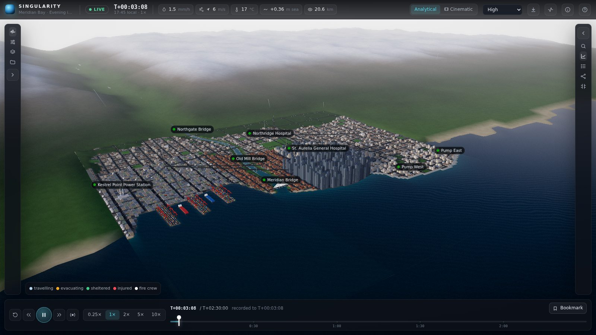
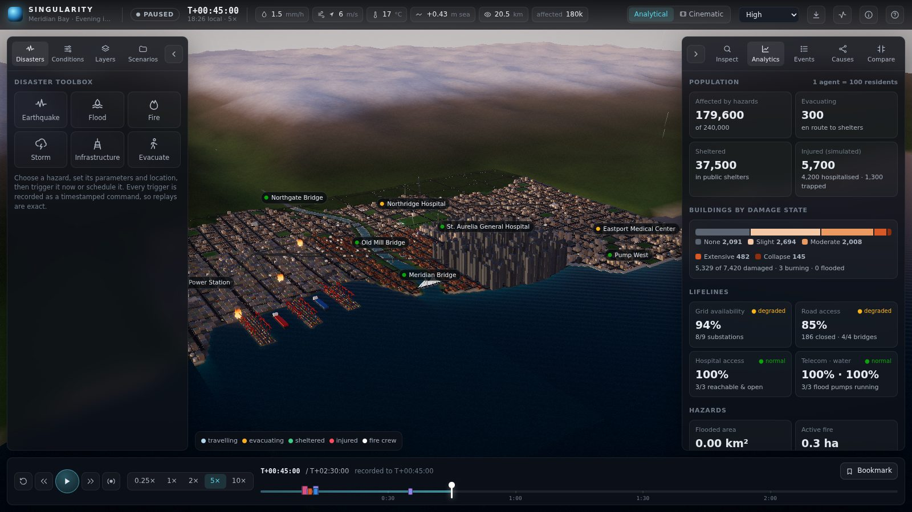
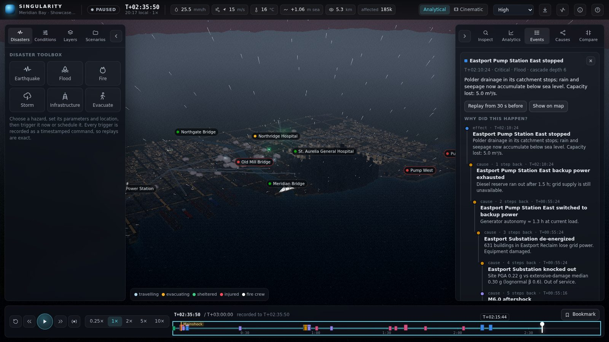
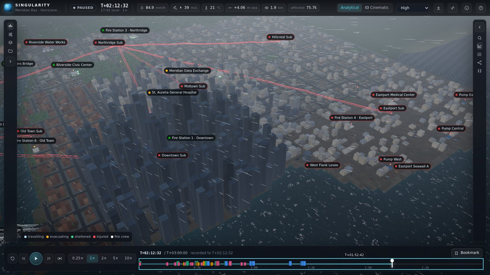
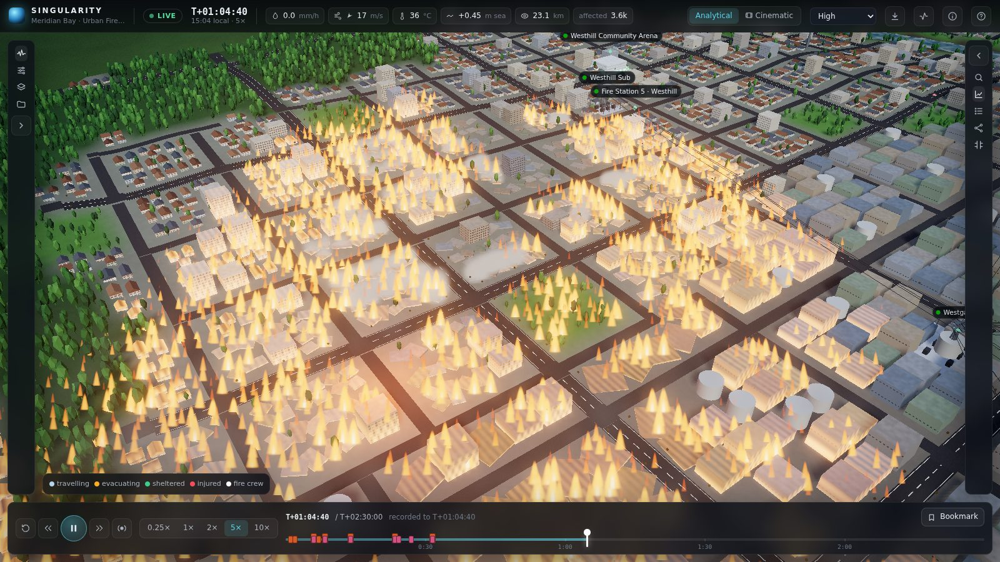
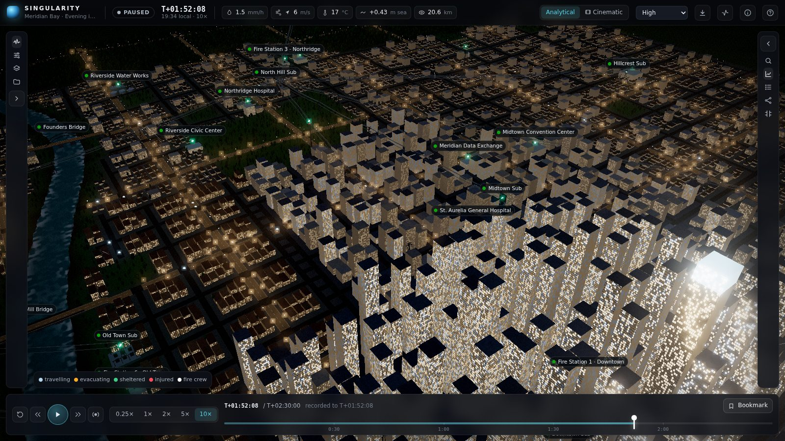
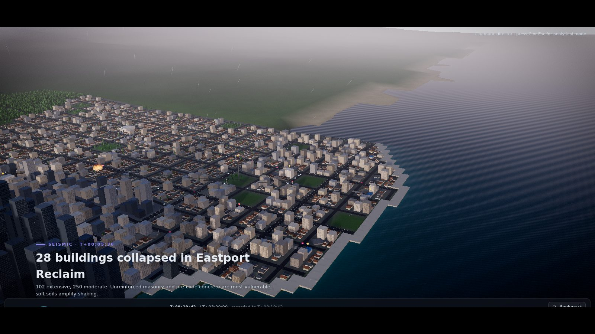

# Project Singularity — Meridian Bay

A browser-based, deterministic catastrophe simulator for a procedurally generated
coastal city. Trigger earthquakes, floods, fires and storms; watch damage and
infrastructure failures cascade through power, water, telecom, roads, hospitals and
240,000 simulated residents; pause, rewind, replay exactly, and compare scenarios run
from identical initial conditions.

TypeScript · React 19 · Three.js (WebGL, custom shaders) · Web Workers · Vite. No
other runtime dependencies.



| | |
|---|---|
|  |  |
| *M6.9 offshore earthquake: damage states, lifelines and population in the analytics panel* | *"Why did this happen?" — a flood-pump stop traced back through diesel exhaustion and a substation to an aftershock* |
|  |  |
| *Cat 4 hurricane: seawall breached, Eastport polder under water, lines down (red)* | *Wind-driven urban firestorm spreading through Westhill* |
|  |  |
| *Evening: occupancy-driven window lights, streetlights and powered substations* | *Cinematic mode frames events automatically and captions them* |

## Run it

Requires Node 20+.

```bash
cd singularity
npm install
npm run dev          # http://localhost:5173
```

(`npm start` does both steps and opens the browser.) A production build is
`npm run build && npm run preview` (http://localhost:4173).

On first launch you get an opening camera shot over the bay, then a short guided tour
(`H` reopens it). Pick **Scenarios → Showcase — Harbor Quake Cascade** for the
default demonstration.

### URL parameters

| Parameter | Effect |
|---|---|
| `scenario=showcase` | Start from a built-in scenario (`baseline`, `showcase`, `hurricane`, `firestorm`, `monsoon`, `mitigated`) |
| `quality=low\|medium\|high\|ultra` | Initial render quality (default `high`; adaptive quality steps it down if frame rate stays low) |
| `autoquality=0` | Disable adaptive quality |
| `intro=0`, `tour=0` / `tour=1` | Skip the opening shot; suppress / force the tour |
| `agents=4000` | Population agents (1 agent = 100 residents, max 5000) |
| `paused=1` | Start paused |

## A five-minute walkthrough

1. **Look around.** Drag to orbit, right-drag to pan, scroll to zoom. Labels mark critical
   facilities; their dot is the live status (green normal, amber on backup/degraded, red down).
2. **Trigger an earthquake.** *Disasters → Earthquake*, keep the defaults (M6.9, 13 km deep,
   offshore) or *Pick on map*, then **Trigger earthquake**. Press `4` for 5× speed.
3. **Watch it propagate.** S-waves reach the city a few simulated seconds later; buildings sway and crack by damage
   state, substations trip, pumps fall back to diesel, roads close under debris, fires start from
   broken gas lines, crews dispatch, residents evacuate to shelters. The top bar, timeline markers
   and toasts follow along.
4. **Inspect.** Click any building, facility, road, bridge or ground cell for its state and
   dependencies. *Events* lists every consequence; select one to see **why** it happened (its
   causal chain back to the root hazard) and what it caused. *Causes* shows the lifeline
   dependency graph and the longest cascades.
5. **Pause and replay.** `Space` pauses; click the timeline or use `←`/`→` (`Shift` = 10 min) to
   seek. Seeking restores the nearest keyframe and deterministically re-simulates; the badge shows
   how many stored checksums were verified. Issuing a new command in the past branches the timeline.
6. **Compare.** *Compare* re-runs your session (A) and a variant (B) — e.g. *mitigated city* or
   *earthquake 0.5 weaker* — from the same seed, population, start time and conditions in
   background workers, then tabulates the outcome.
7. **Cinematic mode** (`C`): an automatic director frames major events, eases the camera, slows
   simulated time for pivotal moments and captions what is happening. `C`/`Esc` returns.

Everything can be exported: metrics CSV, events CSV, summary JSON, and the scenario itself
(JSON, re-importable). Scenarios can be saved to and loaded from the browser library or edited
in the scenario editor (commands, timing, environment, resilience, economics).

### Keyboard

`Space` play/pause · `1`–`5` speed 0.25×/1×/2×/5×/10× · `←`/`→` seek 1 min (`Shift` 10 min) ·
`Home` start · `End` live edge · `B` bookmark · `C` cinematic · `O` overview · `P` plan view ·
`G` diagnostics · `[` / `]` side panels · `H` help/tour · `Esc` cancel.

## How it works

```
 main thread                                   worker thread
┌──────────────────────────────┐   commands   ┌──────────────────────────────────┐
│ React UI (store, panels)     │ ───────────▶ │ SimHost: real-time loop, budgets │
│ Viewport (Three.js renderer) │ ◀─────────── │ SimController: keyframes, replay, │
│  applies frames, animates    │  30 Hz frames│   checksums, branching, history   │
└──────────────────────────────┘ (transferred)│ Simulation: fixed 2 s step        │
                                              └──────────────────────────────────┘
 comparison: two extra headless workers run A and B to the same horizon
```

* **Fixed timestep.** One step = 2 simulated seconds; 1× = 15 steps per real second
  (30 simulated seconds per second). Rendering interpolates and animates independently; the
  worker drops backlog rather than spiralling when a device cannot keep up.
* **Determinism.** The whole state is typed arrays plus plain records. All randomness comes from
  seeded sfc32 streams stored *in* the state or from stateless hashes of (seed, ids, tick). Commands
  are timestamped and applied at step boundaries. Same seed + same commands ⇒ bit-identical state
  on the same JavaScript engine (transcendental functions can differ in the last bit between
  engines, so cross-browser replays are reproducible in behaviour, not guaranteed bit-exact).
* **Replay.** Full-state keyframes (sparse float packing) every 60 steps, thinned as the run grows,
  with an FNV checksum of each. Seeking restores the nearest earlier keyframe and re-simulates;
  every keyframe crossed is re-checksummed. A mismatch would be reported as such — the app never
  shows a reconstructed state as if it were exact.
* **Numerical safety.** Stability-limited substeps for the water solver, positivity limiters,
  clamped fields, a post-step NaN/Inf guard that repairs and counts any non-finite value
  (surfaced in diagnostics; zero in all test scenarios), bounded event log, keyframe budget and
  maximum run length.

## Models (short version — the in-app *Model notes* panel has more)

The goal is plausible, explainable behaviour at city scale, not engineering accuracy.

| System | Model |
|---|---|
| City | Seeded procedural generation on a 128 × 128 grid of 32 m cells: coastline, river with estuary, harbour piers, a below-sea-level polder behind a seawall, ten districts with distinct building stock (~7,400 buildings in seven structural classes), a road graph with arterials and four bridges, and 41 critical assets wired into lifeline networks. |
| Earthquake | Simplified attenuation law with near-source saturation for PGA, soil/saturation amplification, S-wave arrival (3.5 km/s) and a magnitude-dependent duration envelope. HAZUS-style lognormal fragility curves per structural class; accumulated damage weakens buildings for aftershocks. Empirical liquefaction settlement. Aftershocks: Omori–Utsu decay with Gutenberg–Richter magnitudes (Reasenberg–Jones generic parameters). |
| Flood | Local-inertial shallow-water scheme (Bates et al. 2010) with Manning friction and a positivity limiter on the grid; rain modulated by the cloud field, infiltration, drains, powered polder pumps, river inflow, tide + storm surge, levee overtopping, erosion and breach. Depression-filled hills drain realistically. |
| Fire | Cellular spread with heat transfer biased downwind, moisture/temperature ignition thresholds, fuel depletion, wind-driven spotting, suppression by rain, floodwater and crews (who need open roads and water pressure); smoke is advected by the wind. Ignitions come from gas-line breaks in damaged buildings, lightning or the toolbox. |
| Weather | Ambient wind/rain/temperature/visibility plus storms with trapezoidal intensity profiles adding wind, rain, surge and lightning (Poisson strikes under dense cloud, attracted to tall structures). Gust fragilities damage buildings, lines and towers. |
| Infrastructure | Power as graph reachability from live generation through intact lines and substations (no load flow). Consumers switch to backup with finite fuel. Telecom towers depend on the exchange, hospitals on power and water, pumps on power. Roads close for water depth, debris, fire, bridge damage or ground settlement; routing uses Dijkstra tables with separate vehicle and pedestrian passability. |
| Population | 2,400 agents by default (1 agent = 100 residents) commute on the road network with congestion, receive alerts through mobile coverage or word of mouth, evacuate to open shelters (or, when none can be reached, take refuge in a nearby intact building — upper floors if flooded), are injured or trapped by exposure and building damage, and seek hospitals. Injuries are simulated counts; fatalities are deliberately not modelled. |
| Economics | Illustrative only: replacement cost × damage ratio, depth–damage curves and outage-hours for business interruption. All unit values are editable in the scenario editor and labelled as illustrative wherever shown. |

## Limitations

* Everything below 32 m is averaged: water is a cell-scale depth field, fires are cell-scale,
  and buildings take the hazard value of their cell.
* PGA alone drives building fragility (no spectral acceleration, so tall buildings are crude).
  Fragility medians and most rates are illustrative, not calibrated to a real city.
* Power is connectivity, not load flow; there is no voltage, frequency or cascading overload.
* The flood scheme ignores momentum advection and turbulence; storm surge is a uniform sea level.
* Agents route on a coarse graph with zone-level tables and simple congestion; there is no
  lane-level traffic.
* Visual effects (ground sway, rain, smoke volume) are driven by the simulated fields but
  exaggerated for readability.
* Bit-exact replay is guaranteed for the same browser engine; see *Determinism* above.
* Rendering targets desktop GPUs; phones get the low preset and a compact layout.

## Tests and tooling

```bash
npm run typecheck    # strict TypeScript
npm test             # 65 unit/integration tests (vitest, ~1.5 min)
npm run e2e          # 9 Playwright browser tests against the production build
npm run headless -- showcase 180 3   # run a scenario headless: timing, events, metrics
npm run city-map     # render the generated city to city-map.png
```

Unit/integration coverage: math and RNG, city generation invariants (coastal layout, one
connected road network, no buildings on water or roads, determinism by seed), earthquake attenuation and fragility, flood
mass conservation, stability, a quiet river at rest, pumps and levee breaches, fire spread and suppression, infrastructure
dependencies and cascades, evacuation and shelter-in-place, event causality, deterministic replay and branching, scenario
validation/serialisation, CSV/JSON export, extreme inputs (no NaN, bounded memory and event
counts) and full scripted workflows. The browser tests cover launch, earthquake propagation,
pause, causal chains and inspection, replay verification, comparison, local save/load,
keyboard control, onboarding and the phone layout.

Headless performance on the showcase (2,400 agents, 7,420 buildings): ~2.1 ms per simulated
step, i.e. about 3 % of one core at 1× and 30 % at 10×.

## Layout

```
src/sim/          deterministic simulation (no DOM/Three.js imports)
  city/           terrain model, procedural generator, road graph
  systems/        weather, earthquake, flood, fire, infrastructure, routing, emergency, population
  engine.ts       Simulation: state, fixed-step update order, snapshots, checksums
  controller.ts   keyframes, seeking, replay verification, branching, frames
  events.ts       event log, causal chains, explanations
  scenario.ts     built-in scenarios, validation, (de)serialisation
src/worker/       worker entry, host loop, message protocol, main-thread client
src/render/       Three.js layers, shaders, camera rig, director, post-processing, quality
src/ui/           React control centre
tests/            vitest suites          e2e/  Playwright specs
scripts/          headless runner, city map, screenshot helper
```
